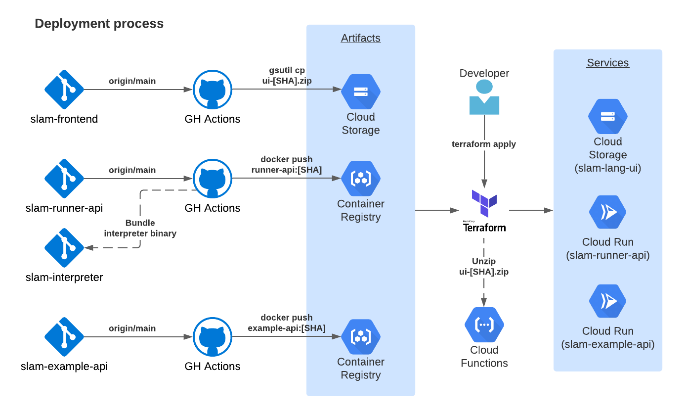

# SLAM infrastructure

SLAM is a procedural, stack-based programming language inspired by Forth and Lisp. You can try SLAM online at https://slamlang.dev. This service is hosted in GCP and defined through the Terraform configs in this repository.

SLAM is a hobby project and should be regarded as such.

## Architecture




## Running

1. Download a suitable SA JSON to the directory root and call it `sa.json`.
2. Set up Node.js 16 local environment (used with GCP Cloud Functions) & `gcloud` CLI
4. Add secrets to `secrets.auto.tfvars`

```
(cd deploy-ui-gcs && npm ci)
export GOOGLE_APPLICATION_CREDENTIALS="$(pwd)/sa.json"
terraform init
terraform apply
```
